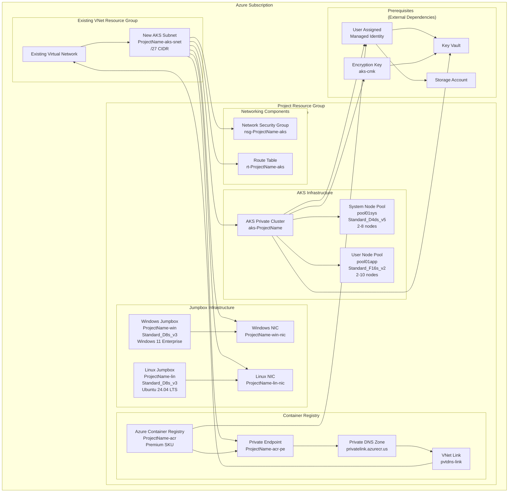

# Architecture of the Solution:

The following Mermaid diagram shows the Azure resources deployed by the ARM template (`infra.json`):



### Resource Summary

The ARM template deploys the following Azure resources:

#### Core Infrastructure
- **Resource Group**: `rg-{projectName}` - Container for all project resources
- **Subnet**: `{projectName}-aks-snet` - Dedicated /27 subnet for AKS within existing VNet
- **Network Security Group**: `nsg-{projectName}-aks` - Network security rules for AKS subnet
- **Route Table**: `rt-{projectName}-aks` - Custom routing rules (optional)

#### Kubernetes Infrastructure  
- **AKS Private Cluster**: `aks-{projectName}` - Private Kubernetes cluster with:
  - System node pool (2-8 Standard_D4ds_v5 VMs)
  - User node pool (2-10 Standard_F16s_v2 VMs)
  - Entra ID integration
  - OIDC issuer and workload identity enabled
  - Key Vault encryption with customer-managed keys
  - FIPS compliance (optional)

#### Container Registry
- **Azure Container Registry**: `{projectName}acr` - Premium SKU registry with:
  - Private endpoint connectivity
  - Network access restrictions
  - Private DNS zone for resolution

#### Management Infrastructure
- **Windows Jumpbox**: `{projectName}-win` - Windows 11 Enterprise VM (Standard_D8s_v3)
- **Linux Jumpbox**: `{projectName}-lin` - Ubuntu 24.04 LTS VM (Standard_D8s_v3)
- **Network Interfaces**: Dedicated NICs for both jumpbox VMs

#### Prerequisites (External)
- **User Assigned Managed Identity**: For AKS cluster authentication
- **Key Vault**: For storing secrets and encryption keys
- **Storage Account**: For persistent storage requirements
- **Existing Virtual Network**: Target network for subnet creation

````